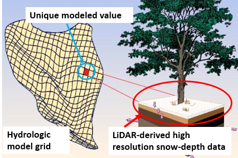

### Project Title: Snow depth spatial variability: data exploration using LiDAR-derived snow depth datasets

#### The problem

Many geospatial problems require an assessment of the spatial variability of environmental data. This is often used to explore the errors between modeled and observed geospatial fields. For example, we often need to know not only the mean difference between datasets, but how those differences vary across the landscape. In addition, just examining the spatial statistics in a geophysical field may reveal things about land surface physcial processes.

#### Application Example

In the mountains, snow depth variability is caused by both accumulation and ablation processes with varying effects from terrain features, wind and vegetation cover. Current estimation method of the amount of water stored in the snowpack has very poor representation of snow spatial variability as it is based on statistical methods and index forecasts using sparse point location data. Recent advancements in LiDAR technology make possible the acquisition of spatially distributed snow depth data at high resolution (1 to 3 m) over large watersheds. Understanding snow depth spatial variability and differential snow melt patterns across complex terrain is crucial for estimating total water stored in the snowpack, and to support spatially distributed forecast hydrologic models. 

 

 

Hydrologic model grid representation. For each model grid cell a single value is computed. Typical model scales are 30, 90, 150m and larger. Running a model at 3-m scale is not feasible due to high computational effort.

These repeat, high-resolution snow depth spatial datasets provide new opportunities to: 

1. understand model subpixel spatial variability of snow depth (see example in Figure 1) across a range of model scales as the ablation season progresses, and 
2. examine spatial patterns of snow depth as a function of terrain and vegetation features for integration with hydrologic modeling.

#### Sample data

The data provided consist of the following, all located over the Tuolumne River watershed, source of San Francisco water supply. All data are at 90 m resolution:

* DHSVM modeled snow water equivalence
* LiDAR-derived snow depth datasets acquired by NASA JPL using airborne LiDAR technology as part of the Airborne Snow Observatory (ASO) program. 
* Digital Elevation Model (DEM) 
* binary vegetation map: 0 = no forest; 1 = forest
 
#### Existing methods

This type of work is often carried out using spatial statistics tools in ArcGIS.

#### Research Questions

The primary question: what are the reasons for differences between the predicted snow water equivalence from the hydrological model versus those from the LiDAR observations?

Related questions:

1. Are errors higher on specific slopes/aspects/shaded areas?
2. Do certain areas of the watershed have larger errors than other due to modeled precip variability?
3. Is there uncertainty in conversion of Lidar snow depth to SWE? Subpixel variability?

#### Possible Methods

1. Identify and use spatial statistics and metrics to characterize snow depth spatial variability. Potential methods can range from moving window statistics and correlation and regression techniques, to variogram and principal component analyses. 
2. Analyze snow depth and snowmelt patterns as a function of both terrain and vegetation cover to examine the relative influence of both factors on snow depth spatial variability and melt rates (examples of terrain-derived data include elevation, curvature, slope, aspect, viewshed (for shade), and topographic radiation).

#### Potential tools:

* variograms? explore the error structure?
* [scikit-learn](http://scikit-learn.org/stable/index.html)
* Earth System Modeling Framework Python interface: [ESMPy](https://www.earthsystemcog.org/projects/esmf/)
*  [xarray](https://geohackweek.github.io/nDarrays/)
* [Nicoleta's libraries](https://github.com/NCristea/WRF_processing)

#### Background reading: 

* Deems, J. S., T. H. Painter, and D. C. Finnegan. 2013. Lidar measurement of snow depth: a review. Journal of Glaciology 59(215): 467-479, doi:10.3189/2013JoG12J154.
* López-Moreno, J. I., Revuelto J., Fassnacht S. R., Azorín-Molina C., Vicente-Serrano S. M., Morán-Tejeda E., and Sexstone G. A. (2015), Snowpack variability across various spatio-temporal resolutions, Hydrol. Process., 29, 1213–1224, doi:10.1002/hyp10245
* Fassnacht, S. R., and J. S. Deems. 2006. Measurement Sampling and Scaling for Deep Montane Snow Depth Data. Hydrological Processes 20: 829-838, doi:10.1002/hyp.6119.
* Revuelto, J.J. I. López-Moreno,C. Azorin-Molina, and S. M. Vicente-Serrano (2015),Canopy influence on snow depth distribution in a pine stand determined from terrestrial laser data,Water Resour. Res., 51, 3476–3489, doi:10.1002/2014WR016496.
* Revuelto, J., J. I. Lopez-Moreno, C. Azorin-Molina, and S. M. Vicente-Serrano (2014), Topographic control of snowpack distribution in a small catchment in the central Spanish Pyrenees: Intra- and inter-annual persistence, Cryosphere, 8, 1989–2006, doi:10.5194/tc-8-1989-2014.

